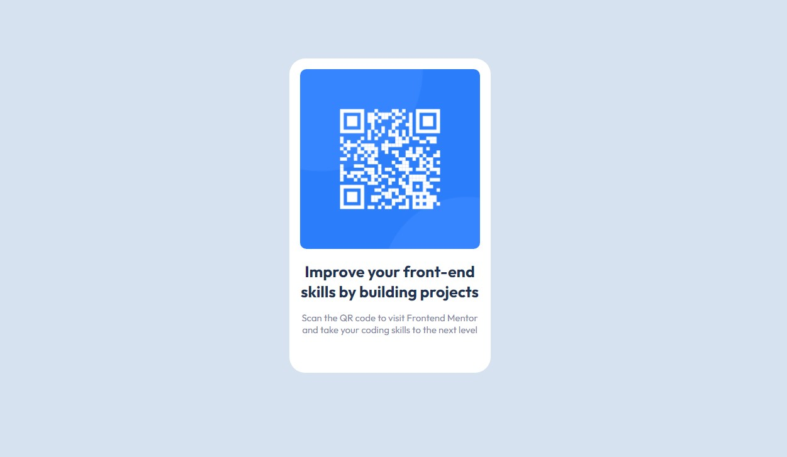

# Frontend Mentor - QR code component solution

This is a solution to the [QR code component challenge on Frontend Mentor](https://www.frontendmentor.io/challenges/qr-code-component-iux_sIO_H). Frontend Mentor challenges help you improve your coding skills by building realistic projects. 

## Table of contents

- [Overview](#overview)
  - [Screenshot](#screenshot)
  - [Links](#links)
- [My process](#my-process)
  - [Built with](#built-with)
  - [What I learned](#what-i-learned)
  - [Continued development](#continued-development)
  - [Useful resources](#useful-resources)
- [Author](#author)


## Overview

### Screenshot
Desktop View -----------------



Mobile View ------------------


### Links

- Solution URL: [Add solution URL here](https://your-solution-url.com)
- Live Site URL: [Add live site URL here](https://your-live-site-url.com)

## My process

### Built with

- Semantic HTML5 markup
- CSS custom properties
- Flexbox
- Mobile-first workflow
- [Google Fonts](https://fonts.google.com/) - For styles


### What I learned
I learned to use more efficiently the display property and to use more responsive measures. 
```css
.proud-of-this-css {
  display: flex;
}
```

### Continued development

I would like to keep improving my use of css, to make it more efficient and cleaner. If you find any bugs or ways to improve my code, I would be very grateful with your feedback.


### Useful resources

- [W3Schools](https://www.w3schools.com/) - This helped me for centered the QR Card. Its practic and undestable.
- [Flexbox Froggy](https://flexboxfroggy.com/) - This is an amazing website to practice the use of flexbox in a very funny way.

## Author

- Website - [Ezequiel Marin](https://www.your-site.com)
- Frontend Mentor - [@vainsito](https://www.frontendmentor.io/profile/yourusername)
- Twitter - [@vainsito](https://www.twitter.com/vainsito)

